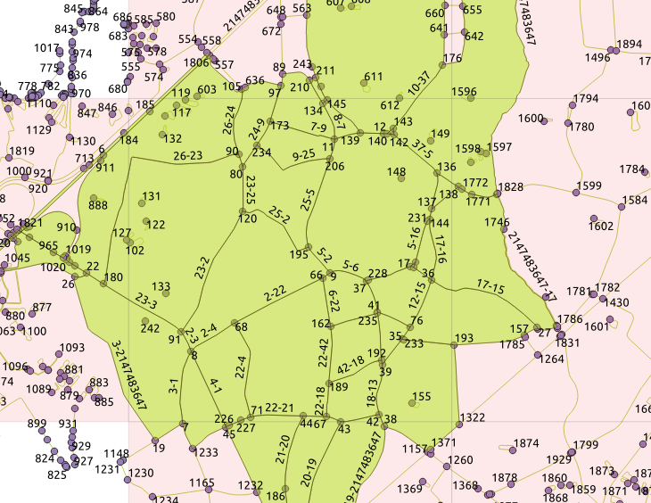
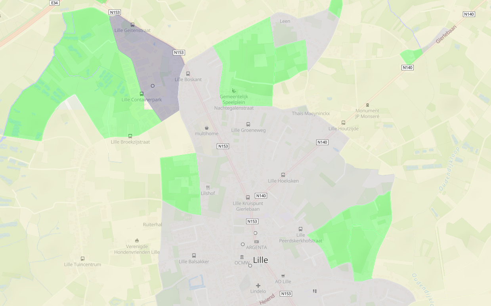

# Urbanistic Polygons

Builds areas based on urban properties and merges similar areas of OSM for analysis reasons.

[/statusIcon)](https://build.anyways.eu/viewType.html?buildTypeId=anyways_MobilityData_UrbanisticPolygons)  

The algorithm works in three steps:

1. [Build](https://en.wikipedia.org/wiki/Planarization) a planar graph based on all types of barriers that are relevant, for example:
  - Roads.
  - Water bodies.
  - Landuse polygons.
  
2. This planer graph defines polygons by definition. Assign urban scores to each polygons. We use the following categories but they are configurable:
  - `water`
  - `residential`
  - `rural`
  - `industrial`
  
3. Merge polygons based on their similarities and the type of barrier between them.

